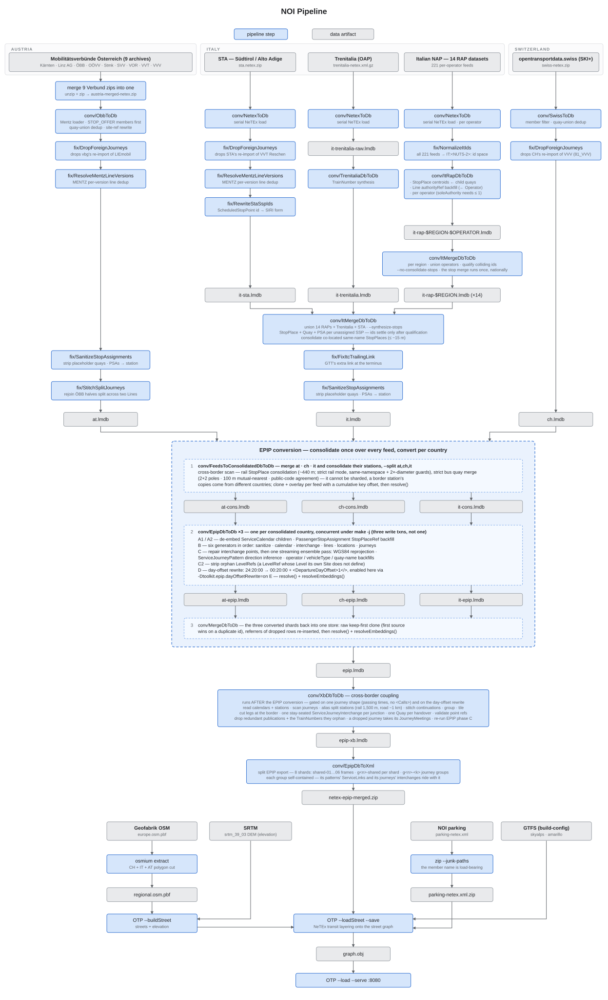

# noi-pipeline

NeTEx feeds → one EPIP zip → an OTP `graph.obj`. The `Makefile` is the whole pipeline;
`make help` lists every target and prints the resolved paths.

Feed set: the Italian RAP operator feeds, Trenitalia and STA/South Tyrol; Switzerland; the Austrian
Verbund exports. `make help` prints the resolved `FEEDSET` with its counts, and
[`docs/datasources.md`](docs/datasources.md) carries the per-region inventory.

## Requires

- On PATH: `java` (JDK 25), `curl`, `python3`, `unzip`, `zip`, `osmium`.
- `netex-toolkit-shaded.jar` fetches itself next to the `Makefile` when missing, from a public release asset.
- `otp-shaded.jar` has to be there before a graph can be built. The OTP this loads is the branch `noi-pipeline`
  in an `OpenTripPlanner` checkout, which carries NeTEx fixes `dev-2.x` has not merged: run
  `mvn -B -ntp package -DskipTests` there and copy `otp-shaded/target/otp-shaded-*.jar` next to the `Makefile`,
  or point `OTP_JAR=<path>` at it where it lies.
- The Austrian feeds need a data.mobilitaetsverbuende.at login, read from the environment and never stored here:
  `export MV_USERNAME=you@example.com MV_PASSWORD='…'`.
- Room and RAM: ~1.6 GB of source feeds, ~140 GB of stores for a full chain, a 16 GB heap per country for the EPIP
  conversion (three run concurrently under `make -j`) and 50 GB for the transit graph build.

## Run

```
make help                # targets, artefact paths, the credentials note
make all                 # everything up to graph/graph.obj
make netex               # just graph/netex-epip-merged.zip
make serve               # OTP on :8080
make download-all        # refresh everything external: the toolkit jar and every source
make download-feeds      # refresh the sources (a plain `make all` never re-downloads)
make verify-inputs       # integrity-check input/ ; repair-inputs re-fetches what fails
make clean               # drop the stores and graphs, keep input/
make clean-feeds         # drop the downloaded source feeds (the AT re-fetch needs the DBP login)
make clean-osm           # drop the OSM + elevation downloads (~34 GB to re-fetch)
make clean-all           # all three: back to a bare checkout (the jars stay)
```

`ROOT` defaults to `$(CURDIR)`; `INPUT_DIR`, `DATA_DIR`, `STATE_DIR` and `OTP_DIR` hang off it, so
`make -C noi-pipeline ROOT=/path/to/workspace all` runs against a workspace elsewhere.
`make print-<NAME>` prints any variable.

## Flow



## Layout

| path                            | what                                                                                |
|---------------------------------|-------------------------------------------------------------------------------------|
| `Makefile`                      | every stage                                                                         |
| `scripts/conv/` `scripts/fix/`  | the drivers, source-launched under JEP 458 — one per stage                          |
| `scripts/transformers/`         | the transforms those drivers call (xb, feedfix, common)                             |
| `scripts/tests/`                | the suite `make test` runs                                                          |
| `scripts/fetch.sh`              | the download gate: verifies the bytes before the `mv`, re-fetches once if they fail |
| `scripts/feed-version.sh`       | publisher versions for the sources that send no `ETag` — see `docs/datasources.md`  |
| `graph/`                        | OTP's base dir — flat, so the configs put there name bare filenames                 |
| `geo/switzerland-italy.geojson` | the polygon `osmium extract` cuts the region PBF with                               |
| `input/` `data/` `state/`       | sources, stores, run timings and download validators                                |

A refresh keeps a source file, and its timestamp, when the bytes come back unchanged, so the stores
built from it are not rebuilt for nothing. `docs/datasources.md` lists what each source revalidates
by.

## Checks

`make test` runs `scripts/tests/AllTests.java` in one JVM; `make compile-gate` javac's every
`.java` under `scripts/`, and is the only check that reaches `ObbToDb` and `SwissToDb`.
